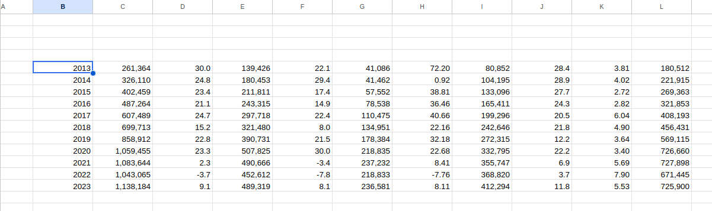
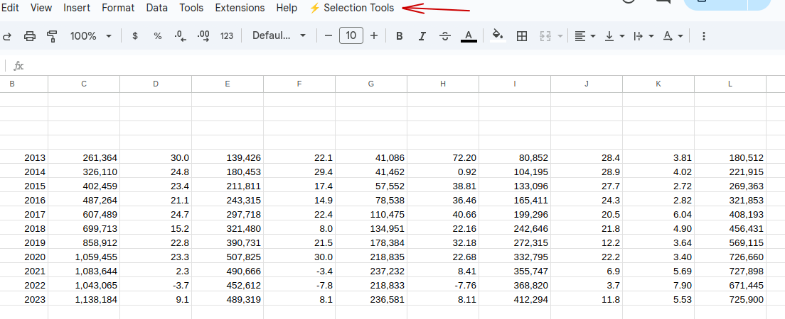
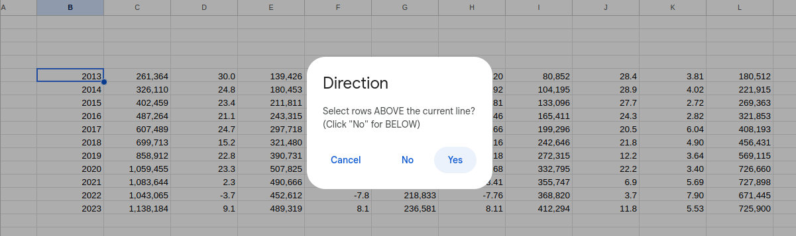
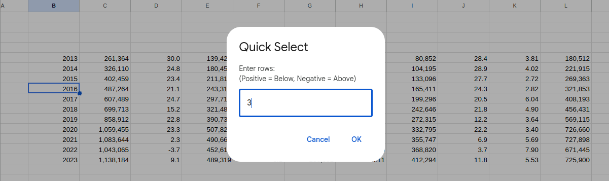

###############################################################
#### Google-Sheets-rows-selector
####
#### M.C. Felipe Raymundo García Cavazos, 9 december 2025
###############################################################

Script: Empty-rows-selector-1

This scrip is used in Google Sheets to select a number (n) of blank or filled rows above or below a
certain selected cell. This code needs firts to be installed (check install steps at the end). How
it works:

1.- Select by mouse a "reference" cell.

2.- Run this script by his name (Empty-rows-selector-1) from the Goolge Sheets taskbar 

3- It will ask for how many rows to select? This is the number of rows above or below the reference
row which will be selected. 

4.- After you enter the number of rows to be selected, press OK and then the code will ask you:
Select rows ABOVE the current line?  or (Click "No" for BELOW)

It will select only the cells that coincide vertically with the filled cells in the row of the
initially selected cell.

Empty-rows-selector-2

This a second version of the script 'Empty-rows-selector-1' and is used in Google Sheets to select 
a number (n) of blank or filled rows above or below a certain filled row but the process needs only
one step in the pop up window. 

1.- You select first by the mouse a cell as in the first script and run it  by his name 
    'Empty-rows-selector-2' from the Goolge sheets toolbar. It will ask for the number of rows
    above (enter a number with a negative sign) or below (enter a number with a positive sign)
    which will be selected. 
     

As with version 1, it will select only the cells that coincide vertically with the filled cells in
the row the initially selected cell.

How to install it:

## 🚀 How to Install

1. **Open your Google Sheet** where you want to use the script.
2. Go to the top menu and select **Extensions** > **Apps Script**-
3. (you need firs to have **Apps Script** installed in your Google Sheets)
4. **Copy the code** from the `code.gs` file in this repository.
5. Delete any code in the Apps Script editor and **paste** the new code.
6. Click the **Save** icon (diskette) and name the project "Selection tools".
7. **Refresh** your Google Sheet. You should see a new menu item appear (e.g., "Selection Tools").
